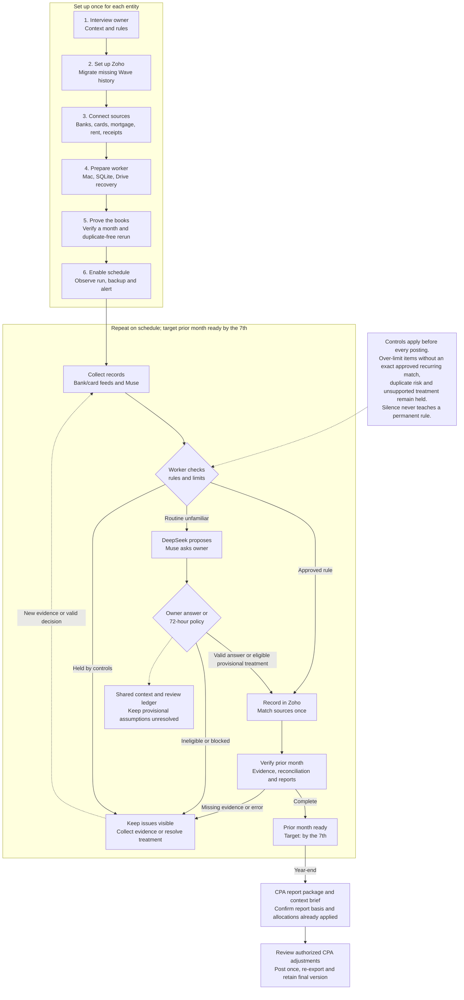

# AI bookkeeper flowchart

[Printable PDF](ai-bookkeeper-flowchart.pdf) | [Executive overview](EXECUTIVE_OVERVIEW.md)

```mermaid
%% Editable source for the executive process map. Diagram describes intended operation.
flowchart TB
  subgraph SETUP[Set up once for each entity]
    direction LR
    S1[1. Interview owner<br/>Context and rules] --> S2[2. Set up Zoho<br/>Migrate missing Wave history]
    S2 --> S3[3. Connect sources<br/>Banks, cards, mortgage, rent, receipts]
    S3 --> S4[4. Prepare worker<br/>Mac, SQLite, Drive recovery]
    S4 --> S5[5. Prove the books<br/>Verify a month and duplicate-free rerun]
    S5 --> S6[6. Enable schedule<br/>Observe run, backup and alert]
  end
  S6 --> C
  subgraph REPEAT[Repeat on schedule; target prior month ready by the 7th]
    C[Collect records<br/>Bank/card feeds and Muse] --> R{Worker checks<br/>rules and limits}
    R -->|Approved rule| Z[Record in Zoho<br/>Match sources once]
    R -->|Routine unfamiliar| A[DeepSeek proposes<br/>Muse asks owner]
    R -->|Held by controls| H[Keep issues visible<br/>Collect evidence or resolve treatment]
    A --> D{Owner answer or<br/>72-hour policy}
    D -->|Valid answer or eligible provisional treatment| Z
    D -->|Ineligible or blocked| H
    Z --> M[Verify prior month<br/>Evidence, reconciliation and reports]
    M -->|Complete| G[Prior month ready<br/>Target: by the 7th]
    M -->|Missing evidence or error| H
    H -.->|New evidence or valid decision| C
    D -.-> L[Shared context and review ledger<br/>Keep provisional assumptions unresolved]
  end
  N[Controls apply before every posting.<br/>Over-limit items without an exact approved recurring match,<br/>duplicate risk and unsupported treatment remain held.<br/>Silence never teaches a permanent rule.]
  N -.-> R
  G -->|Year-end| CPA[CPA report package and context brief<br/>Confirm report basis and allocations already applied]
  CPA --> ADJ[Review authorized CPA adjustments<br/>Post once, re-export and retain final version]

```
